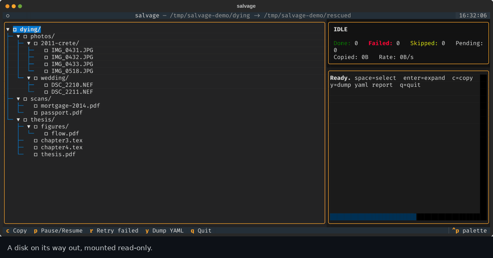

# grim-disk-reader

A resilient, resumable, TUI-driven file copier for pulling data off a dying disk.




[](https://ko-fi.com/V3Y22788IC)

Browse the source tree, check off what matters, and let it run, a bad sector
on one file gets logged and skipped instead of hanging the whole job, every
attempt is remembered so you can walk away and resume later, and you get a
paper trail of exactly what happened to every file.


## Features

- Browse the source tree and check off what to copy, at directory or file granularity.
- The destination tree is rebuilt with the same structure, with original file timestamps (`mtime`/`atime`) preserved.
- A bad sector or stuck read doesn't hang the whole run: each file copy is watched by a supervisor that kills and restarts the copy worker if a read makes zero progress for too long (default 20s), then marks that file failed and moves on.
- Every attempt (success/failure, bytes copied, error message) is persisted to a SQLite state file next to the destination, so you can quit and resume later, or run repeated passes as the disk continues to degrade. Already-successful files are never re-copied.
- Folders in the tree are color-coded from the live copy state: red if any attempt underneath failed, green once everything underneath has succeeded, yellow while partially done, cyan while in progress.
- A mirror tree of small YAML metadata stubs (one per attempted file: size, timestamps, copy status, error...) can be maintained alongside the real copy, for auditing without touching file contents.
- The full source tree, including files you never selected, can be dumped to a single YAML report on demand, each entry annotated with its current selection/copy status.

> [!IMPORTANT]
> **Mount the failing disk read-only if you can.** This tool never writes to
> the source, but if the disk is actively failing, minimizing any writes to it
> (including filesystem journal updates from a normal read-write mount)
> reduces further wear. Use `mount -o ro` (see [`scripts/mount-ro.sh`](#scriptsmount-rosh)
> below) or a read-only USB/SATA adapter where possible.

## Contents

- [Setup](#setup)
- [Usage](#usage)
- [Keybindings](#keybindings)
- [Per-file metadata stubs](#per-file-metadata-stubs-salvage-manifest)
- [Full tree YAML report](#full-tree-yaml-report)
- [`scripts/mount-ro.sh`](#scriptsmount-rosh)
- [Suggested end-to-end workflow](#suggested-end-to-end-workflow-drive-attached-over-usb-eg-into-a-vm)
- [Running the tests](#running-the-tests)
- [Project layout](#project-layout)

## Setup

Requires Python 3.10+.

```bash
python3 -m venv .venv
./.venv/bin/pip install -e .
```

## Usage

```bash
./.venv/bin/salvage /path/to/dying/disk /path/to/safe/destination
```

or, without installing the console script:

```bash
./.venv/bin/python -m salvage /path/to/dying/disk /path/to/safe/destination
```

Options:

| Flag | Default | Description |
|---|---|---|
| `--state-db PATH` | `<dest>/.salvage-state.sqlite3` | SQLite state file location. |
| `--chunk-size BYTES` | 4 MiB | Read/write chunk size. |
| `--stall-timeout SECONDS` | 20 | Seconds with zero read progress before a file is treated as stuck. |
| `--manifest-dir NAME` | `.salvage-manifest` | Where to mirror the source tree with per-file YAML metadata stubs, relative to dest. |
| `--no-manifest` | off | Disable the metadata-stub mirror tree entirely. |
| `--dump-tree-yaml [PATH]` | `<dest>/salvage-tree-report.yaml` | Write the full source-tree status report and exit immediately, without launching the TUI. |

## Keybindings

| Key | Action |
|---|---|
| `space` | Toggle selection on the highlighted file/folder (selecting a folder selects everything under it; drill in to deselect individual items). |
| `enter` | Expand/collapse a folder. |
| `c` | Start a copy pass over everything currently selected. |
| `p` | Pause/resume (finishes the file in flight first). |
| `r` | Requeue every currently-failed file for another attempt, then press `c` again. |
| `y` | Dump the full source-tree YAML report to `<dest>/salvage-tree-report.yaml` (same as `--dump-tree-yaml`, on demand, without leaving the TUI). |
| `q` | Quit (safe mid-copy; state is saved incrementally after every file). |

## Per-file metadata stubs (`.salvage-manifest/`)

For every file `salvage` attempts (success or failure), it writes a small YAML
stub at the same relative path under the manifest directory, with `.txt`
appended so it's visually obvious it's a stand-in, not the real file:

```
dest/.salvage-manifest/docs/resume.pdf.txt
```

```yaml
path: docs/resume.pdf
name: resume.pdf
kind: file
size: 20
mtime: '2026-07-14T10:21:37.315450+00:00'
status: failed
bytes_copied: 0
attempts: 1
last_attempt: '2026-07-14T10:31:32.000000+00:00'
last_success: null
error: "PermissionError: [Errno 13] Permission denied: '/mnt/dying/docs/resume.pdf'"
dest_exists: false
```

`created` (best-effort file creation time) is included when the platform
actually exposes it: Linux's standard `stat()` doesn't, so it's normally
absent there. Files that were never selected get no stub at all. Disable the
whole thing with `--no-manifest`.

## Full tree YAML report

Unlike the manifest stubs (which only cover files that were selected),
`--dump-tree-yaml` / the `y` key walks the *entire* live source tree, so you
get one YAML file with every file and directory, each annotated with
`selected`, `status` (`not_selected` / `pending` / `in_progress` / `success` /
`failed` / `skipped`), size, timestamps, and any error, a single document you
can grep, diff between runs, or archive as a manifest of the whole recovery,
including everything you decided *not* to copy.

## `scripts/mount-ro.sh`

Mounts a drive/partition (or a `ddrescue` image file) read-only, with the right
safety flags for the detected filesystem (`noload` for ext, `norecovery` for
xfs, `ntfs-3g` for NTFS). Works on either a block device or a raw image file;
for an image it auto-attaches a partition-scanning loop device first.

```bash
sudo ./scripts/mount-ro.sh /dev/disk/by-id/usb-XXXX-part1 /mnt/dying
sudo ./scripts/mount-ro.sh /data/rescue.img /mnt/rescue 2   # partition 2 inside the image
```

## Suggested end-to-end workflow (drive attached over USB, e.g. into a VM)

1. **Check drive health first**: `smartctl -a -d sat /dev/disk/by-id/usb-XXXX`.
   Climbing reallocated/pending-sector counts or a drive that's clicking means
   handle it gently; if it still looks basically sound, you can skip straight
   to step 3.
2. **If the drive is in bad shape, image it once with `ddrescue` before doing
   anything else**, so you only stress the physical drive a single time:
   ```bash
   apt install gddrescue   # package is gddrescue, binary is ddrescue
   ddrescue -f -n /dev/sdX image.img rescue.log   # fast first pass
   ddrescue -f -r3 /dev/sdX image.img rescue.log  # slower retry pass on what's left
   ```
   Note `ddrescue` images the whole block device (it has no concept of
   filesystem-used-space), so plan destination space for the full device size,
   not just what's actually in use; use `-S`/`--sparse` to at least skip
   genuinely all-zero regions. If the filesystem still mounts fine and you
   only care about the live files, skipping this step and going straight at
   the live mount is usually faster and needs far less space.
3. **Mount read-only**: either the live device/partition or (if you imaged
   it) the `.img` file, via [`scripts/mount-ro.sh`](#scriptsmount-rosh) above.
4. **Run `salvage`** against that read-only mount, selecting what you need.
5. **If the drive drops out mid-copy**, don't panic: reconnect it, remount at
   the same path, and re-run `salvage` with the same source/dest, and it skips
   everything already marked successful and only retries what's outstanding
   (press `r` in the TUI to requeue anything that hit a real failure).

> [!TIP]
> Keep the mount and the tool on the same side of any VM boundary, e.g. pass
> the raw block device through to a VM (`qm set <vmid> -scsi3
> /dev/disk/by-id/usb-XXXX` on Proxmox) and do steps 3-5 inside that VM,
> rather than mounting on a hypervisor and trying to share the mounted
> filesystem back into a VM over NFS/virtiofs/9p, which adds a whole
> sharing-protocol layer for no benefit in a one-off recovery job.

## Running the tests

```bash
./.venv/bin/pip install -e . pytest
./.venv/bin/python -m pytest tests/ -v
```

Includes an end-to-end headless TUI test (via Textual's `run_test` pilot) that
drives real keypresses against a synthetic tree with a deliberately unreadable
file, and checks both the copy outcome and the tree's internal status
coloring.

## Project layout

```
salvage/
  state_db.py     SQLite persistence: selection overrides, per-file copy status
  selection.py     Recursive include/exclude selection logic
  worker.py        Killable subprocess that does the actual chunked file copy
  copier.py        Walks the selected tree, drives the worker, writes manifest stubs
  report.py        Shared metadata record + full-tree YAML report builder
  tree_widget.py   Checkbox tree widget with live status coloring
  app.py           Textual application (layout, keybindings, progress/log panels)
  __main__.py      CLI entry point
scripts/
  mount-ro.sh      Read-only mount helper (block device or ddrescue image)
tests/
```

## Licence

MIT. See `LICENSE`.

Written by Alessandro Corbetta, a physicist, after a disk with twelve years of
photos on it started clicking. If it got yours back, there is a Ko-fi
link near the top of this page.
